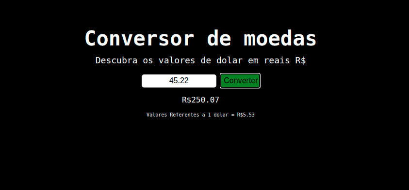
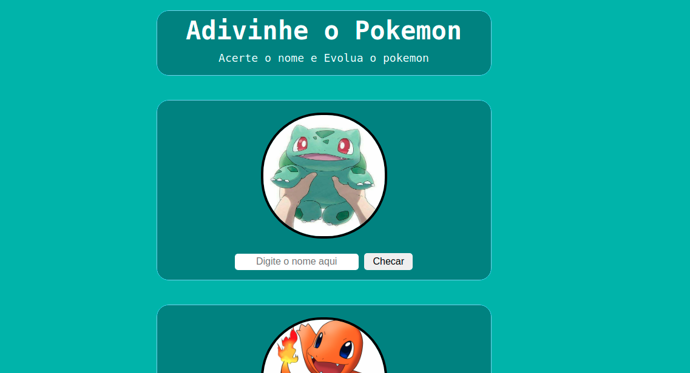
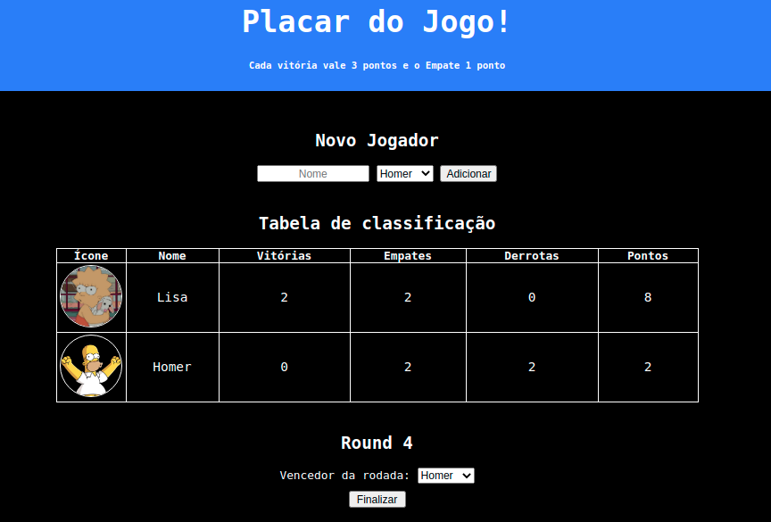
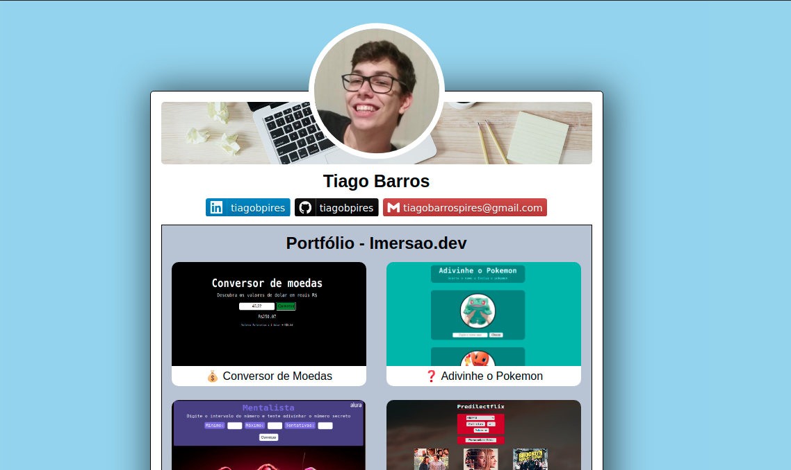

# ImersaoDev-Alura

Sites feitos na Imersao Dev da Alura

## 💰 Conversor de Moedas

## ❓ Adivinhe o Pokemon

## 🔮 Mentalista

## 🎬 PredilectFlix

## 🏆 Tabela de Classificação

## 🃏 Super Trunfo Pokemon

## 🎓 Certificard

