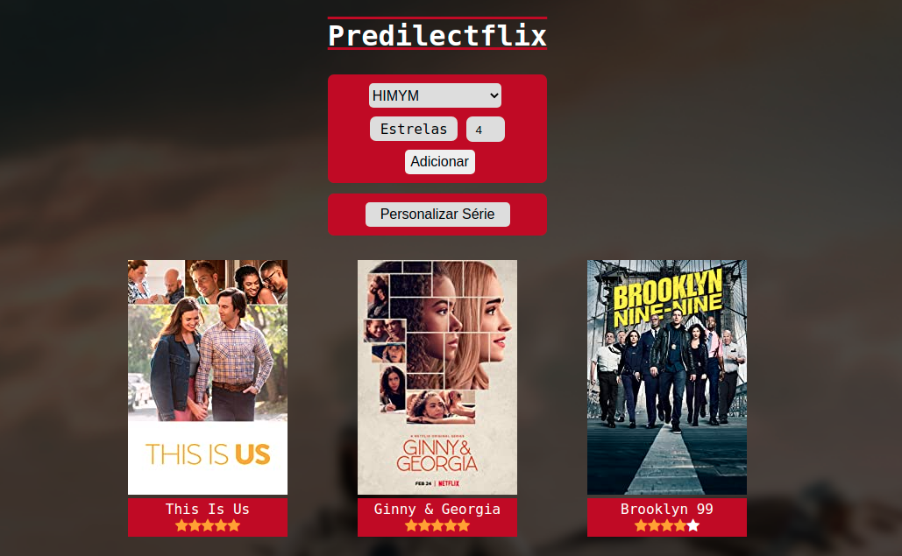
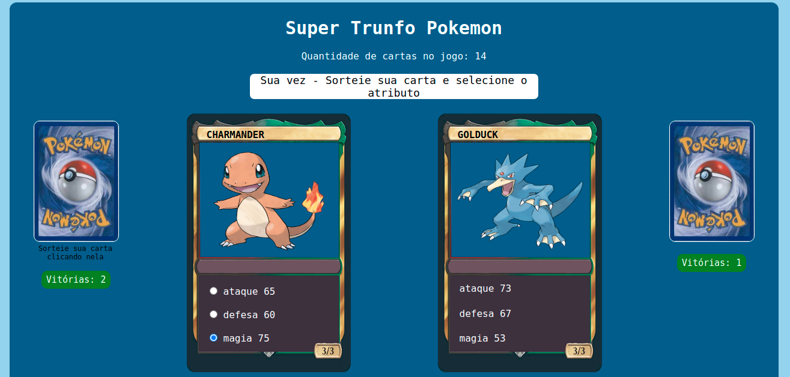

# ImersaoDev-Alura

### Portfólio feito no evento ImersãoDev da Alura, focado em lógica de programação com Javascript

 
  

Disponível no <a href="https://tiagobpires.github.io/ImersaoDev-Alura/">githubpages</a>

💰 Conversor de Moedas   | ❓ Adivinhe o Pokemon
:----------: | :----------:
 | 
🔮 Mentalista  |  🎬 PredilectFlix
 | 
🏆 Tabela de Classificação  |  🃏 Super Trunfo Pokemon
 | 
